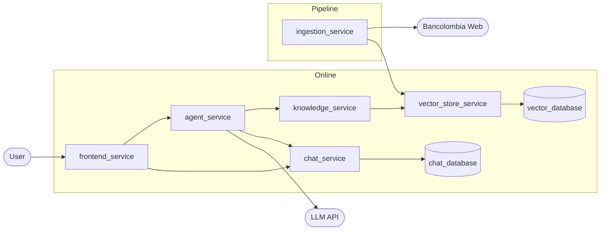
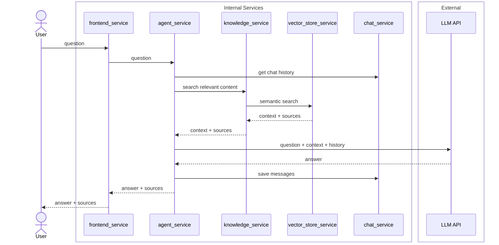
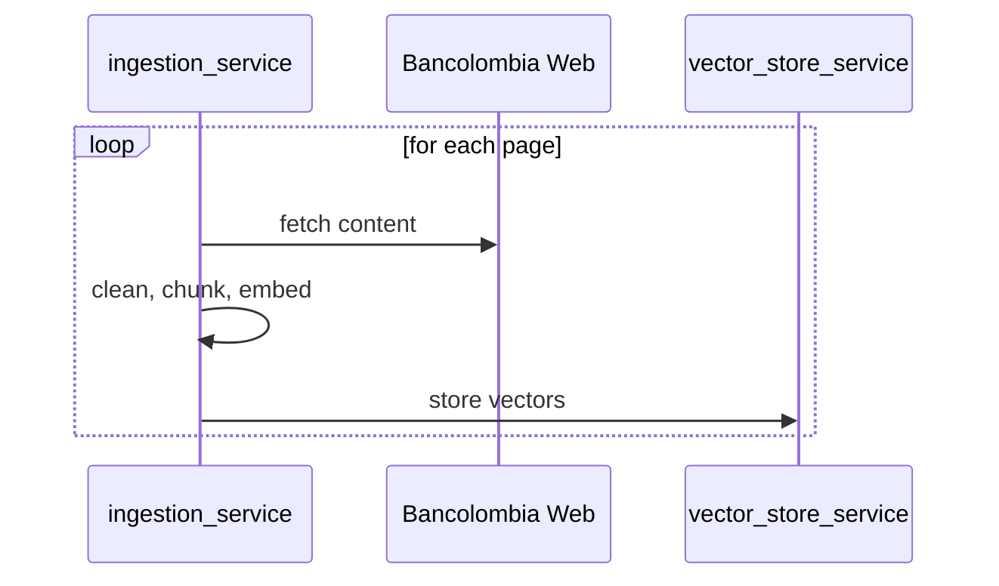

# Architecture

## Diagram 1 — General Architecture

```mermaid
flowchart LR
    User([User])
    LLM([LLM API])
    Web([Bancolombia Web])

    subgraph Online
        Front[frontend_service]
        Agent[agent_service]
        Knowledge[knowledge_service]
        Chat[chat_service]
        VectorStore[vector_store_service]
        VectorDB[(vector_database)]
        ChatDB[(chat_database)]
    end

    subgraph Pipeline
        Ingestion[ingestion_service]
    end

    User --> Front
    Front --> Agent
    Front --> Chat
    Agent --> Knowledge
    Agent --> Chat
    Agent --> LLM
    Knowledge --> VectorStore
    VectorStore --> VectorDB
    Chat --> ChatDB
    Ingestion --> Web
    Ingestion --> VectorStore
```

---

## Diagram 2 — Query Flow

```mermaid
sequenceDiagram
    actor U as User
    box Internal Services
        participant F as frontend_service
        participant A as agent_service
        participant K as knowledge_service
        participant V as vector_store_service
        participant C as chat_service
    end
    box External
        participant L as LLM API
    end

    U->>F: question
    F->>A: question
    A->>C: get chat history
    A->>K: search relevant content
    K->>V: semantic search
    V-->>K: context + sources
    K-->>A: context + sources
    A->>L: question + context + history
    L-->>A: answer
    A->>C: save messages
    A-->>F: answer + sources
    F-->>U: answer + sources
```

---

## Diagram 3 — Ingestion Flow

```mermaid
sequenceDiagram
    participant I as ingestion_service
    participant W as Bancolombia Web
    participant V as vector_store_service

    loop for each page
        I->>W: fetch content
        I->>I: clean, chunk, embed
        I->>V: store vectors
    end
```
